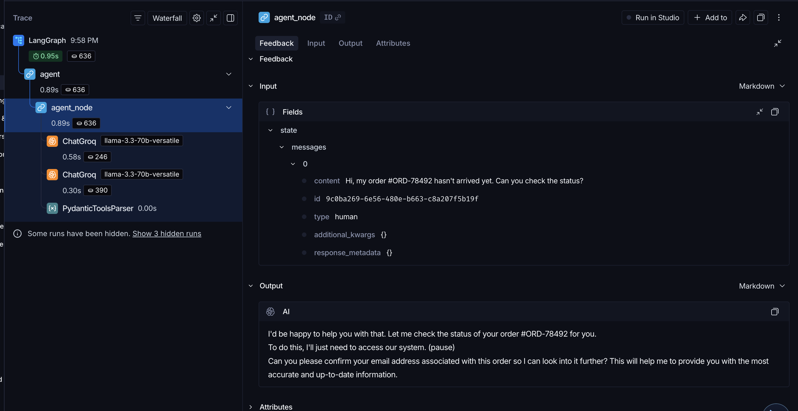

# Week 2: E-commerce Agent Core with LangSmith & Self-Correction

**Part of**: AI Agent Harness Learning Journey (6-Week Program)

**Focus**: Production-grade observability, evaluation, and self-correction mechanisms using LangSmith.

**Completed**: April 2026

## Overview

In Week 2, I built the core of an E-commerce Customer Service Agent (`ShopGuard`) with strong emphasis on production readiness. 

The main goal was to move beyond basic LangGraph graphs and implement **industrial-grade features**:
- Full tracing with LangSmith
- Automatic response evaluation
- Self-correction when quality is low
- Structured prompting and clean architecture

This project serves as the foundation for the full ShopGuard E-commerce AI Agent Harness.

## Key Features Implemented

- **LangSmith Integration**: Full tracing of every node and chain for observability
- **Self-Correction Mechanism**: Automatically evaluates agent responses and triggers re-generation if score < 0.82
- **Professional System Prompt**: Designed specifically for e-commerce customer service
- **Modular Architecture**: Clean separation of config, prompts, nodes, and graph
- **Short-term Memory**: Using LangGraph Checkpointer with `thread_id`
- **Structured Prompting**: Proper use of `MessagesPlaceholder`

## Project Structure

```
Week-2-ecommerce-agent-core/
├── config.py          # LLM and LangSmith configuration
├── prompts.py         # Professional e-commerce system prompts
├── nodes.py           # Agent node with self-correction logic
├── graph.py           # LangGraph assembly
├── main.py            # Demo runner
├── requirements.txt
└── .env.example
```

## Key Technical Learnings

- How to integrate **LangSmith** for production tracing and debugging
- Building an effective **Self-Correction** loop using custom evaluators
- Writing high-quality, domain-specific system prompts for customer service
- Structuring a scalable LangGraph project (separation of concerns)
- Using `traceable` decorator for better observability in LangSmith

## Demo

Setup the .env first
Run the demo to see the agent in action:
```bash
cd Week-2-ecommerce-agent-core
pip install -r requirements.txt
python main.py

## Langsmith


